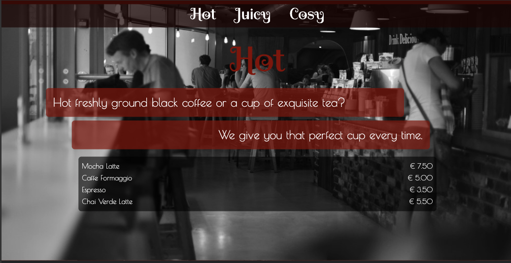

# Caffe Retro

A simple, stylish webpage for Caffe Retro, showcasing different sections: Hot, Juicy, and Cosy. This project demonstrates the use of semantic HTML elements and CSS styling to create a visually appealing website.


## Demo



## Features

- Fixed navigation menu with smooth scrolling
- Three distinct sections: Hot, Juicy, and Cosy
- Background images for each section
- Semantic HTML elements for better accessibility
- Responsive design
- Custom fonts and styles
- Red horizontal line at the bottom of each section for visual separation

## Installation

1. Clone the repository:

```bash
git clone https://github.com/kerry-space/Caffe-Retro.git